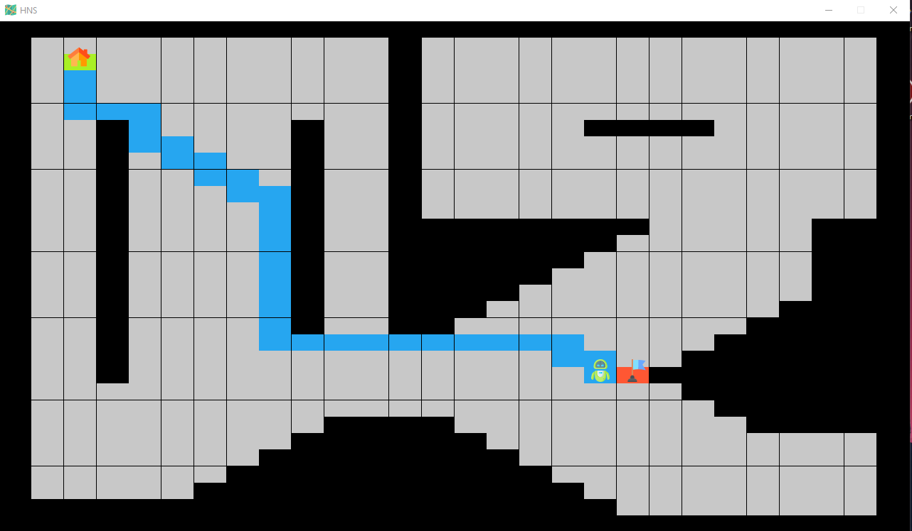

[](https://github.com/davidvelascogarcia/hns/tree/develop/programs) [](https://github.com/davidvelascogarcia/hns/tags) [](https://travis-ci.org/davidvelascogarcia/hns)

# HNS: Heuristic Navigation System (Python)

- [Introduction](#introduction)
- [Requirements](#requirements)
- [Run](#run)
- [YARP support](#yarp-support)
- [Status](#status)


## Introduction

This document describes the `hns` program. An implementation of a heuristic algorithm of type `Greedy`. This implementation has been inspired by the non-uniform or non-unitary algorithms of the `Greedy` type, specifically the` Best First Search` or `Priority First Search`.

This implementation has been carried out using the `Python` language and the property that it is not possible to return to a previously visited position has been considered in order to try to make the algorithm as direct with respect to the goal as possible.

Regarding the algorithm logic, various modifications have been made to the `Best First Search` algorithm.

In each of the different positions, the system analyzes the upper, lower, right and left locations to see their status, whether it is a free space, occupied, visited, start or goal, inspired by a more exhaustive algorithm.

In the first place, unlike the `Best First Search` standard, for decision making between the different nodes, instead of selecting the node with the shortest distance to advance, the decision has been made regarding the absolute distance in axes of greater magnitude, in order to advance with greater speed towards the goal.

Additionally, with regard to not being able to advance, the logic for the succession of priorities would be the next axis in its sense of approximation, if it is not feasible, the third option will be proceeded with this same axis but reversed direction, and Finally, if it were not feasible, the last option would be the opposite axis, in the opposite direction to the approximation.

In turn, to take the direction of advance, it has only been carried out by means of the commands move up, down, right and left, for which the sign of the difference between final and initial coordinates is used, therefore no taken into account the diagonals.

Finally, note that given the function of reading the map in `csv` format, the horizontal coordinates are equivalent to the variable` Y`, and the vertical coordinates to the variable `X`.

* **Example:**

Taking as initial position in configuration (y, x), the coordinates (2,2) and goal, the coordinate (21,19). The differences between the final and initial value in absolute value would be (19,17), and therefore it would first move on the vertical axis, in order to advance an absolute value as fast as possible to the goal.

In case of not being able to advance on the vertical axis, it would proceed with the horizontal one, and so on in each of the points.

The algorithm would calculate the distance at each node and move accordingly.

An example of a calculated route is attached in Fig. 1.

<p align="center">
  
  <br>Figure 1. Cálculo de ruta en el mapa 11</br>
</p>

In the execution example, the time required is 1.84 [s] and a total of 36 nodes required.

Regarding the execution tests, this algorithm has been executed satisfactorily, using the default start and finish points of (2,2) and (7,2) in maps 1,2,3,4, 5,7,8,9,10,11, as well as in the 12 and 13 generated additionally. In turn, tests have been carried out on map 11 with the objective points (21,19), (21, 10), (21, 15) among others. Observing that in very angular changes of direction it cannot advance due to the condition of not being able to visit a node again, as is the case in map 6.

## Requirements

`hns` requires the following `python` libraries:

* Install datetime
```bash
pip3 install datetime
```

* Install halo
```bash
pip3 install halo
```

* Install numpy
```bash
pip3 install numpy
```

* Install pandas
```bash
pip3 install pandas
```

To install all dependences directly:

```bash
pip3 install -r requirements.txt
```

Tested on: `ubuntu 16.04`, `kubuntu 20.04`, and `windows 10`.


## Run


1. Run [programs/hns.py](./programs).
```python
python3 hns.py
```

NOTE:

The following arguments are allowed per terminal:

- Maps dir `--dir`
- Map `--map`
- Start location `--init`
- End location `--goal`
- YARP middleware `--yarp`
- Target port `--target`
- Target response port `--response`

The following execution example is attached:

```python
python3 hns.py --dir ./../maps --map map11.csv --init 2,2 --goal 21,19 --yarp True --target \robot\controller:i --response \robot\controller:o
```

In the absence of input arguments, the map path of the previous location, map number 11 `map11.csv` and the predefined coordinates in the example will be set by default, that is,` START (2,2) ` and `GOAL (21, 19)`.

Additionally, note that in case of running on `windows 10`, if running on` Git Bash` it may be required to replace the call to the `Python` interpreter as` python` instead of `python3`.

## YARP support

As has been seen, the system supports the `YARP` communications middleware, therefore, at each decision made by the planner, that is, ** UP **, ** DOWN **, ** RIGHT * *, ** LEFT ** and ** GOAL **, this value will be sent to the controller of the target system and will wait until it receives its execution response.

The sending and receiving ports of `hns` are` /hns/controller:o` and `/hns/controller:i`, respectively.

## Status

[](https://travis-ci.org/davidvelascogarcia/hns)

[](https://github.com/davidvelascogarcia/hns/issues)

